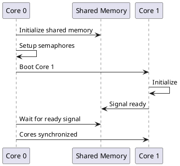

# Task Description: Generate Phase 1 Architecture Diagrams

## Goal
Create comprehensive visual documentation for the AMP MCU Phase 1 implementation, including architecture diagrams, sequence diagrams, memory layouts, and data flow visualizations to improve understanding and adoption of the reference implementation.

## Background
The current Phase 1 implementation has excellent code and text documentation, but lacks visual diagrams that help developers quickly understand:
- Overall system architecture and component relationships
- Boot sequence and core handoff flow
- Memory layout and shared regions
- IPC message flow patterns
- State machines and synchronization

Visual diagrams are essential for:
- Onboarding new contributors
- Explaining architecture to stakeholders
- Porting to new platforms
- Teaching AMP concepts

## Files/Modules Involved

### New Files to Create
- `docs/diagrams/architecture-overview.svg` - High-level system architecture
- `docs/diagrams/boot-sequence.svg` - Core boot and handoff sequence
- `docs/diagrams/memory-layout.svg` - Shared memory organization
- `docs/diagrams/mailbox-flow.svg` - Mailbox communication flow
- `docs/diagrams/semaphore-states.svg` - Semaphore state machine
- `docs/diagrams/ringbuf-structure.svg` - Ring buffer data structure
- `docs/diagrams/component-dependencies.svg` - Component relationship diagram
- `docs/DIAGRAMS.md` - Index and description of all diagrams

### Source Files for Diagrams
- `docs/diagrams/src/architecture-overview.plantuml` - PlantUML source
- `docs/diagrams/src/boot-sequence.plantuml` - PlantUML source
- `docs/diagrams/src/memory-layout.plantuml` - PlantUML source
- `docs/diagrams/src/mailbox-flow.plantuml` - PlantUML source
- `docs/diagrams/src/semaphore-states.plantuml` - PlantUML source
- `docs/diagrams/src/ringbuf-structure.plantuml` - PlantUML source
- `docs/diagrams/Makefile` - Build system for generating SVG from sources

### Files to Update
- `README.md` - Add "Architecture Diagrams" section with links
- `docs/AMP_CONTRACT.md` - Embed relevant diagrams
- `docs/EXAMPLES.md` - Add sequence diagrams for each example

## Expected Inputs and Outputs

### Inputs
1. **Existing Documentation**:
   - README.md structure and component list
   - AMP_CONTRACT.md specifications
   - Source code (amp_boot.c, amp_mailbox.c, etc.)
   - Example applications

2. **Diagram Sources**:
   - PlantUML files for sequence/component diagrams
   - SVG/draw.io files for architecture diagrams
   - ASCII art for simple inline diagrams

### Outputs
1. **Visual Diagrams** (SVG format):
   - Architecture overview showing all components
   - Boot sequence with core synchronization
   - Memory layout with address ranges
   - Message flow for each IPC primitive
   - State machines for synchronization primitives

2. **Documentation**:
   - DIAGRAMS.md index file
   - Embedded diagrams in existing docs
   - Updated README with visual navigation

## Functional Requirements

### FR1: Architecture Overview Diagram
- **Content**: Show all runtime components (boot, mailbox, semaphore, ringbuf, shmem, config)
- **Style**: High-level block diagram
- **Details**: Component boundaries, public APIs, shared memory regions
- **Format**: SVG (PlantUML component diagram)
- **Acceptance**: Clearly shows relationship between all Phase 1 components

### FR2: Boot Sequence Diagram
- **Content**: Core 0 and Core 1 boot sequence with synchronization points
- **Style**: UML sequence diagram
- **Details**: 
  - Core 0: init → boot Core 1 → wait ready
  - Core 1: wait boot → init → signal ready
  - Shared memory initialization
  - Semaphore handshake
- **Format**: SVG (PlantUML sequence diagram)
- **Acceptance**: Developers can understand exact boot flow

### FR3: Memory Layout Diagram
- **Content**: Physical memory map showing Core 0 private, Core 1 private, and shared regions
- **Style**: Memory map with address ranges
- **Details**:
  - RP2350 example layout (256KB SRAM0, 16KB shared, 240KB SRAM1)
  - Generic platform template
  - Shared memory structures (mailbox, semaphore, ringbuf)
- **Format**: SVG (visual diagram)
- **Acceptance**: Clear understanding of where each component lives in memory

### FR4: IPC Flow Diagrams
- **Content**: Message flow for mailbox, semaphore, and ring buffer
- **Style**: Sequence diagrams showing core interactions
- **Details**:
  - Mailbox send/receive with semaphore protection
  - Ring buffer producer/consumer pattern
  - Semaphore acquire/release
- **Format**: SVG (PlantUML sequence diagrams)
- **Acceptance**: Shows complete message lifecycle

### FR5: State Machine Diagrams
- **Content**: State transitions for semaphore and mailbox
- **Style**: UML state machine diagrams
- **Details**:
  - Semaphore: free → acquired → free
  - Mailbox: empty → has_messages → full
  - Error states and transitions
- **Format**: SVG (PlantUML state diagrams)
- **Acceptance**: All valid states and transitions documented

### FR6: Component Dependency Diagram
- **Content**: Show which components depend on which
- **Style**: Dependency graph
- **Details**:
  - Examples → runtime components → platform
  - Layering (applications → primitives → platform)
- **Format**: SVG (PlantUML component diagram)
- **Acceptance**: Clear understanding of component hierarchy

## Non-Functional Requirements

### NFR1: Maintainability
- Use text-based source formats (PlantUML) for version control
- Provide Makefile or script to regenerate all diagrams
- Include comments in diagram sources
- Keep diagrams synchronized with code

### NFR2: Accessibility
- SVG format for scalability
- High contrast colors
- Clear labels and legends
- Alternative text descriptions in DIAGRAMS.md

### NFR3: Consistency
- Uniform style across all diagrams
- Consistent color coding (Core 0 = blue, Core 1 = green, shared = yellow)
- Standard component shapes
- Readable at different zoom levels

### NFR4: Completeness
- Cover all Phase 1 components
- Show both normal and error flows
- Include platform-specific examples (RP2350)
- Provide generic templates

## Acceptance Criteria

### AC1: Diagram Coverage
- [ ] Architecture overview diagram created and accurate
- [ ] Boot sequence diagram shows complete handoff flow
- [ ] Memory layout diagram for RP2350 included
- [ ] Generic memory layout template provided
- [ ] Mailbox flow diagram complete
- [ ] Semaphore state machine diagram complete
- [ ] Ring buffer structure diagram complete
- [ ] Component dependency diagram complete

### AC2: Documentation Integration
- [ ] DIAGRAMS.md index created with descriptions
- [ ] README.md updated with "Architecture" section
- [ ] AMP_CONTRACT.md embeds relevant diagrams
- [ ] EXAMPLES.md includes example-specific diagrams
- [ ] All diagrams have alt text descriptions

### AC3: Quality
- [ ] All diagrams are SVG format (scalable)
- [ ] Diagrams use consistent styling
- [ ] Labels are clear and readable
- [ ] Color coding is consistent (Core 0/1/shared)
- [ ] No spelling errors in diagrams

### AC4: Buildability
- [ ] Makefile or script to regenerate diagrams from source
- [ ] PlantUML sources are valid and compile
- [ ] Build instructions in docs/diagrams/README.md
- [ ] CI integration to validate diagrams (optional)

### AC5: Accuracy
- [ ] Diagrams match actual code behavior
- [ ] Address ranges match linker scripts
- [ ] API calls in diagrams match actual APIs
- [ ] Reviewed against source code for correctness

## Implementation Notes

### Recommended Tools

1. **PlantUML** - For sequence, component, and state diagrams
   - Text-based, version control friendly
   - Easy to maintain and update
   - Can be integrated into build process

2. **draw.io** - For architecture and memory layouts
   - Free, web-based or desktop
   - Exports to SVG
   - Good for custom layouts

3. **Alternative**: Mermaid (embedded in markdown)
   - GitHub renders natively
   - Simpler syntax than PlantUML
   - Limited styling options

### Example PlantUML Snippet



### Color Coding Standards

- **Core 0 (Primary)**: Blue (#4A90E2)
- **Core 1 (Secondary)**: Green (#7ED321)
- **Shared Memory**: Yellow (#F5A623)
- **Semaphore**: Orange (#F8E71C)
- **Error States**: Red (#D0021B)

### Directory Structure

```
docs/
├── diagrams/
│   ├── README.md              # How to build diagrams
│   ├── Makefile               # Build all diagrams
│   ├── src/                   # PlantUML/source files
│   │   ├── architecture-overview.plantuml
│   │   ├── boot-sequence.plantuml
│   │   ├── memory-layout.plantuml
│   │   ├── mailbox-flow.plantuml
│   │   ├── semaphore-states.plantuml
│   │   └── ringbuf-structure.plantuml
│   └── *.svg                  # Generated SVG files
└── DIAGRAMS.md                # Diagram index and guide
```

## Dependencies
- PlantUML (Java-based, can run in CI)
- Optional: Graphviz (for PlantUML rendering)
- Make (for build automation)
- Existing documentation files

## Estimated Effort
- Setup PlantUML and build system: 1 hour
- Architecture overview diagram: 1 hour
- Boot sequence diagram: 1.5 hours
- Memory layout diagrams: 1.5 hours
- IPC flow diagrams (3x): 2 hours
- State machine diagrams: 1 hour
- Component dependency diagram: 0.5 hours
- Documentation integration: 1.5 hours
- Review and refinement: 1 hour
- **Total: ~11 hours (single development session over 1-2 days)**

## Success Metrics
- All 7+ diagrams created and integrated
- Diagrams are accurate and match code
- Documentation references diagrams appropriately
- Positive feedback from reviewers on clarity
- Diagrams can be regenerated from source
- No accessibility issues reported
- Addresses lack of visual documentation in Phase 1

## References
- PlantUML: https://plantuml.com/
- UML Sequence Diagrams: https://www.uml-diagrams.org/sequence-diagrams.html
- Color accessibility: https://webaim.org/resources/contrastchecker/
